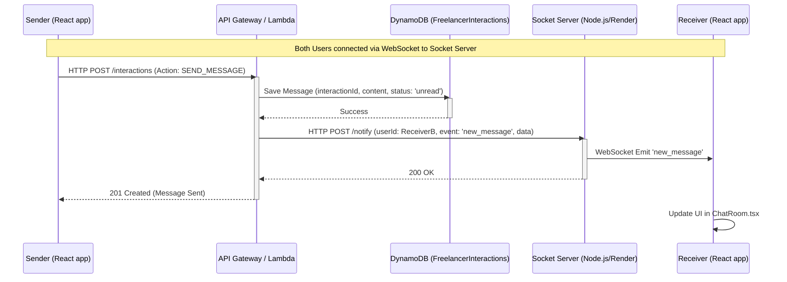

# Chat Architecture Diagram

The real-time chat system in Project Bazaar follows a hybrid approach: **HTTP for persistence** and **WebSockets for real-time delivery**.

## Data Flow Diagram

## Component Overview

### 1. Frontend (React)
- **`SocketContext.tsx`**: Manages the life cycle of the WebSocket connection to the server on Render. 
- **`ChatRoom.tsx`**: 
    - Subscribes to `new_message` events via `useSocket()`.
    - Fetches message history from Lambda on load.
    - Sends new messages via the `sendFreelancerMessage` service (HTTP).

### 2. Backend (AWS Lambda)
- **`freelancer_interactions_handler.py`**:
    - Validates incoming messages.
    - Stores them in the `FreelancerInteractions` DynamoDB table.
    - Triggers the real-time push by notifying the Socket Server.

### 3. Socket Server (Node.js)
- **Service**: Hosted on Render as a dedicated server.
- **Responsibility**: Maintains a registry of active `userId` -> `socketId` mappings.
- **Relay**: Acts as a bridge, receiving HTTP notifications from AWS and pushing them to the correct client via WebSockets.

## Technology Stack
- **Real-time**: Socket.io / WebSockets
- **Persistence**: AWS DynamoDB
- **Compute**: AWS Lambda (Python), Node.js (Express/Socket.io)
- **Frontend**: React (TypeScript/Tailwind)
