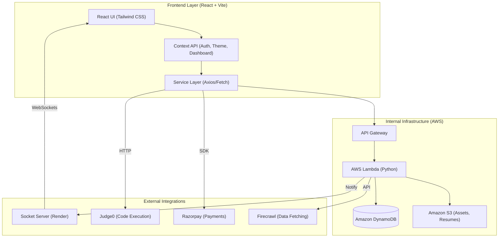

# Project Bazaar High-Level Architecture

Project Bazaar is built on a modern, serverless, and cloud-native architecture designed for scalability, modularity, and rapid delivery of features.

## High-Level Architecture Overview

## System Components

### 1. Frontend Layer
- **Framework**: React with TypeScript, using Vite for fast builds.
- **State Management**: React Context API handles global states for authentication, theme, and dashboard views.
- **Service Layer**: A collection of modular services (`buyerApi`, `freelancersApi`, etc.) that abstract HTTP communication with the backend.

### 2. Backend & Persistence (AWS)
- **API Gateway**: Serves as the entry point for all frontend requests, routing them to the correct Lambda functions.
- **AWS Lambda**: The compute layer, consisting of dozens of specialized Python functions handling everything from user authentication to complex AI-driven resume scoring.
- **Amazon DynamoDB**: The primary NoSQL database for structured data like users, projects, interactions, and progress.
- **Amazon S3**: Used for storing binary assets, user resumes, and generated portfolios.

### 3. Real-Time Interactions (Render)
- **Socket Server**: A dedicated Node.js server hosted on Render. It manages WebSocket connections to enable real-time features like instant messaging and notifications, bridging the gap between stateless Lambda functions and connected clients.

### 4. Specialized Integrations
- **Judge0**: An external API used for secure, real-time code execution in Mock Assessments.
- **Razorpay**: Integrated for secure transaction processing and order management.
- **Firecrawl**: Used by specific Lambda functions to fetch and process external data, such as trending hackathons.

## Architecture Philosophy
- **Serverless First**: Minimizes operational overhead and allows for seamless scaling.
- **Decoupled Components**: Real-time logic is separated from persistence logic to ensure reliability.
- **Modular Services**: The project is structured into clear feature areas (Marketplace, Learning, Freelancer Hub) both on the frontend and backend.
