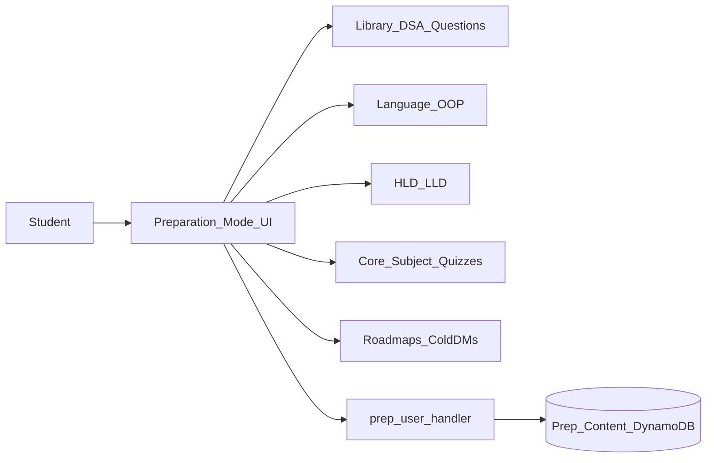
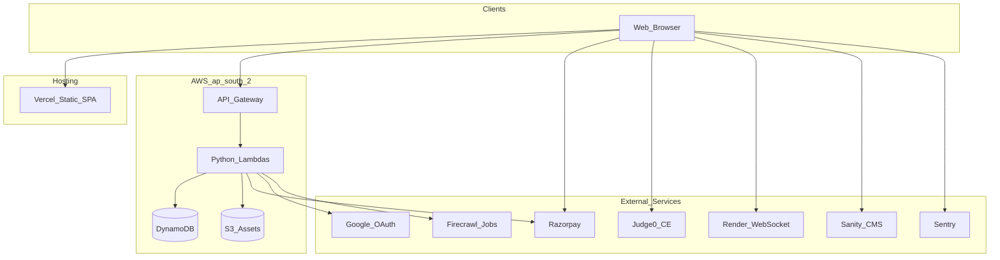
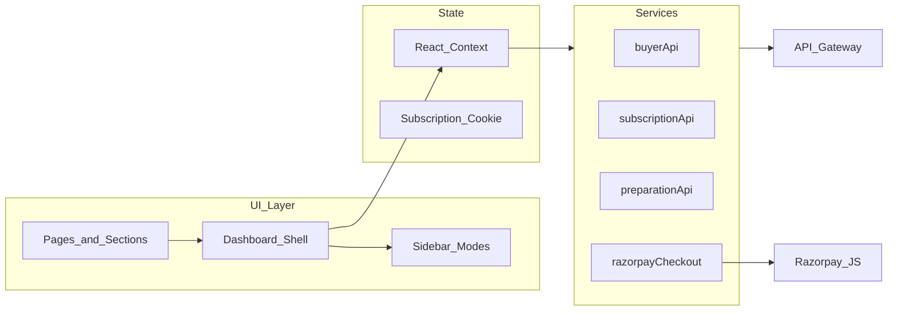
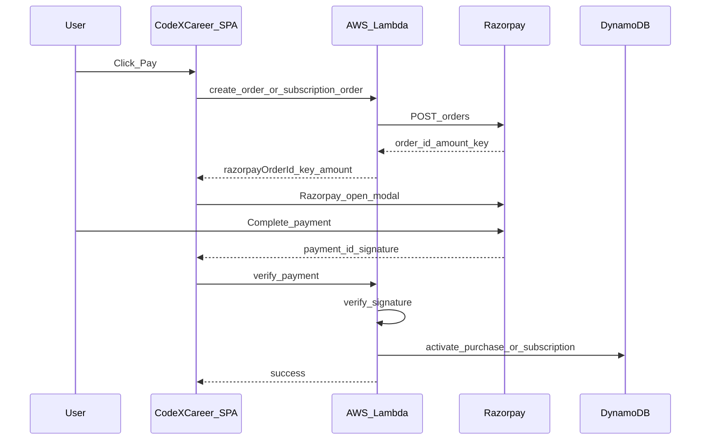
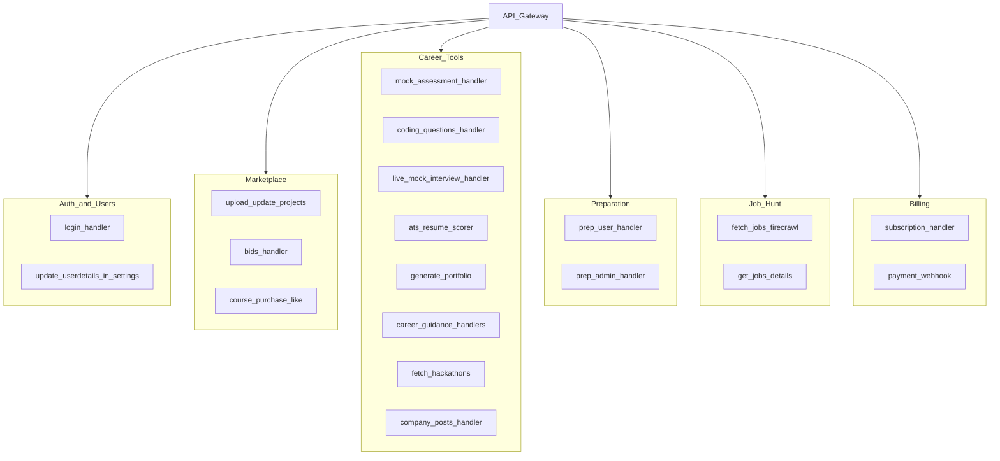

# CodeXCareer

> Discover projects, prepare for placements, and grow your career — in one place.

**Live:** [codexcareer.com](https://codexcareer.com) · **Repository:** [github.com/SAIMANEESHWAR/ProjectBazaar](https://github.com/SAIMANEESHWAR/ProjectBazaar)

CodeXCareer is an all-in-one platform for students and professionals: buy and sell project templates, run a full **placement preparation** curriculum, use AI-powered career tools, and hunt jobs — from a single dashboard. Payments are in INR via Razorpay.

> **Note:** The GitHub repository folder is named `ProjectBazaar`; the product brand is **CodeXCareer**.

---

## What CodeXCareer provides

Students and job seekers often juggle scattered tabs for DSA, system design, company-specific prep, resumes, and job boards — while also needing ready-made projects for submissions or portfolios. CodeXCareer unifies **Preparation Mode**, **career tools**, **marketplace**, and **job hunt** in one place.

### Who it is for

| Audience | What they get |
|----------|----------------|
| **Students & job seekers** | Structured interview prep, coding practice, AI mock interviews, ATS resume checks, job hunt |
| **Buyers** | Ready-made projects, courses, cart checkout, wishlist |
| **Sellers / freelancers** | List projects, receive bids, track earnings and payouts |
| **Premium subscribers** | Tiered access to career and prep features (INR plans below) |

### Dashboard experiences

| Mode | Purpose |
|------|---------|
| **Career** | Live AI interviews, hackathons, AI resume builder, ATS scorer, portfolio builder, mock assessments, coding questions, career guidance |
| **Marketplace** | Project bazaar, courses, cart, purchases, wishlist, analytics |
| **Preparation Mode** | **Flagship placement-prep curriculum** — see [Preparation Mode](#preparation-mode) |
| **Job Hunt** | Browse roles and save jobs |
| **Seller** | Post projects, manage bids, earnings, payouts, analytics |

### Premium plans (INR)

| Plan | Price | Included features |
|------|-------|-------------------|
| **Monthly** | ₹299/month | Job hunt, hackathons, company posts, AI resume builder |
| **Yearly** | ₹699/year | Monthly features + **Preparation Mode**, live AI interviews, ATS scorer, coding questions |
| **Lifetime** | ₹999 one-time | All platform features |

Subscriptions and purchases use **Razorpay** (UPI, cards, wallets). Backend setup: [lambda/SUBSCRIPTION_SETUP.md](lambda/SUBSCRIPTION_SETUP.md).

---

## Preparation Mode

**Preparation Mode** is CodeXCareer’s core placement-prep product — a dedicated workspace you open from the main dashboard (not a loose collection of links). It delivers a **structured, company-ready interview curriculum**: theory, practice, system design, company/role tracks, and outreach — without leaving the app.

**Premium access:** Included on **Yearly** and **Lifetime** plans. The **Monthly** plan does not include Preparation Mode.

### Why it matters

One workflow for placement season:

1. **Learn** — handwritten notes, language fundamentals, OOP  
2. **Practice** — DSA, aptitude, quizzes, core-subject topic tests  
3. **Design** — high-level and low-level system design  
4. **Target** — role-wise and company-wise resource tracks  
5. **Apply** — job portals, roadmaps, cold DM / email templates  
6. **Track** — preparation hub and activity  

### Curriculum map

| Group | Modules |
|-------|---------|
| **Library** | All Interview Questions, Role Wise Resources, Company Wise Resources, DSA Questions, Aptitude Questions, Handwritten Notes, Quiz |
| **Fundamentals** | Language, OOPs Concepts |
| **System Design** | High Level Design, Low Level Design |
| **Research** | Job Portals, Roadmap, Cold DMs / Emails |
| **Platform** | Preparation Hub, My Activity |
| **Core Subjects** | Topic-folder quizzes (e.g. OS, DBMS, CN) with nested navigation |

Content is served by `prep_user_handler` and managed via `prep_admin_handler`. For local dev you can seed content with `npm run seed:prep`.

### Preparation Mode flow



---

## Features

### Marketplace and courses

- Browse and buy digital projects and templates  
- Wishlist, cart, and secure **Razorpay** checkout  
- Course catalog with purchase and enrollment  
- Payment webhooks for order fulfillment  

### Seller tools

- Post projects and manage listings  
- Bid requests and bid management  
- Earnings, payouts, and seller analytics  

### Career tools

| Tool | Benefit |
|------|---------|
| **Live AI Interviews** | Simulate interviews with AI feedback |
| **Hackathons** | Discover upcoming hackathons |
| **AI Resume Builder** | Build ATS-friendly resumes with live preview |
| **ATS Scorer** | Score resume fit before applying |
| **Build Portfolio** | Generate and publish a portfolio from your profile |
| **Company Posts** | Read and share interview experiences and insights |
| **Mock Assessments** | Timed tests with code execution (Judge0, 20+ languages) |
| **Coding Questions** | Curated interview coding sets with discussions |
| **Career Guidance** | Roadmaps and guided content with progress tracking |

### Job Hunt

- Browse job listings (aggregated via backend jobs pipeline)  
- Save jobs and track applications from the dashboard  

### Platform

- **Google OAuth** sign-in  
- **Admin panel** for moderation and prep content  
- Optional **Sanity CMS** for blog/content  
- **Sentry** for error monitoring  

---

## Architecture

CodeXCareer’s frontend is a React SPA on **Vercel**. Business logic runs on **AWS Lambda** (Python) behind **API Gateway** in `ap-south-2`. Data lives in **DynamoDB**; files (resumes, portfolios, uploads) in **S3**.

### System context



### Frontend layers



Payment UI is centralized in `lib/razorpayCheckout.ts`. API base URLs are configured in `lib/apiConfig.ts`.

### Payment flow



Covers cart/project checkout (`payment_webhook.py`), courses (`course_purchase_handler.py`), and subscriptions (`subscription_handler.py`).

### Backend (Lambda domains)



| Domain | Example handlers | Typical data |
|--------|------------------|--------------|
| Auth | `login_handler` | Users |
| Marketplace | `bids_handler`, `course_purchase_handler` | Projects, orders |
| Career | `mock_assessment_handler`, `live_mock_interview_handler` | Progress, content |
| Preparation | `prep_user_handler`, `prep_admin_handler` | Prep content |
| Job Hunt | `fetch_jobs_firecrawl`, `get_jobs_details` | Jobs cache |
| Billing | `subscription_handler`, `payment_webhook` | UserSubscriptions, payments |

There are 38+ handlers under `lambda/`; see also [PROJECT_ARCHITECTURE.md](PROJECT_ARCHITECTURE.md) and [DOCUMENTATION.md](DOCUMENTATION.md).

---

## Technical stack

| Layer | Technologies |
|-------|----------------|
| **Frontend** | React 19, TypeScript, Vite, Tailwind CSS, Framer Motion, Radix UI, Monaco Editor, Lottie |
| **Backend** | Python 3.11+ on AWS Lambda, API Gateway, DynamoDB, S3 |
| **Payments** | Razorpay Standard Checkout |
| **Code execution** | Judge0 CE (`https://ce.judge0.com`, overridable) |
| **Auth** | Google OAuth (login Lambda) |
| **CMS** (optional) | Sanity |
| **Realtime** | WebSocket server on Render (chat / live features) |
| **Observability** | Sentry |
| **Deploy** | Vercel (frontend); AWS Console or IaC for Lambdas |

npm package name: `codex-career`.

---

## Getting started

### Prerequisites

- Node.js 18+
- npm

### Installation

1. **Clone the repository**

    ```bash
   git clone https://github.com/SAIMANEESHWAR/ProjectBazaar.git
    cd ProjectBazaar
    ```

2. **Install dependencies**

    ```bash
    npm install
    ```

3. **Environment variables**

   Copy `.env.example` to `.env.local` and override as needed:

   | Variable | Required | Description |
   |----------|----------|-------------|
   | `VITE_LOGIN_API_URL` | Optional | Login/signup API Gateway URL (default in `lib/apiConfig.ts`) |
   | `VITE_SUBSCRIPTION_API_URL` | Optional | Subscription Lambda URL |
   | `VITE_GOOGLE_REDIRECT_URI` | Prod | Must match Google Cloud redirect URI (e.g. `https://codexcareer.com/auth`) |
   | `VITE_JUDGE0_BASE_URL` | Optional | Custom Judge0 host (default: `https://ce.judge0.com`) |
   | `VITE_JUDGE0_AUTH_TOKEN` | Optional | Judge0 API key for private/RapidAPI instances |
   | `VITE_SANITY_*` | Optional | Sanity CMS for blog/content |
   | `VITE_GTM_ID` | Optional | Google Tag Manager |

   **Razorpay** (`RAZORPAY_KEY_ID`, `RAZORPAY_KEY_SECRET`) are set on **Lambda only**, not in the frontend env file.

4. **Run locally**

    ```bash
    npm run dev
    ```

5. **Production build**

    ```bash
    npm run build
    ```

### Scripts

| Command | Description |
|---------|-------------|
| `npm run dev` | Start Vite dev server |
| `npm run build` | Typecheck + production build |
| `npm run preview` | Preview production build |
| `npm test` | Run Vitest |
| `npm run test:run` | Vitest single run |
| `npm run seed:prep` | Seed preparation content (dev) |
| `npm run clear:prep` | Clear prep content (dev) |

### Judge0 (mock assessments and coding questions)

- **Default:** Public Judge0 CE at `https://ce.judge0.com` — no config required.  
- **Custom:** Set `VITE_JUDGE0_BASE_URL` and optionally `VITE_JUDGE0_AUTH_TOKEN` in `.env.local`, then restart dev or rebuild.

---

## Project structure

```
ProjectBazaar/                 # repo root (product: CodeXCareer)
├── components/                # React pages, dashboard, prep UI, sections
├── context/                   # Auth, subscription, dashboard state
├── services/                  # API clients (buyer, subscription, preparation, …)
├── lib/                       # Razorpay checkout, API config, utilities
├── data/                      # Pricing plans, prep config, static data
├── hooks/                     # Custom React hooks
├── lambda/                    # AWS Lambda handlers (Python)
├── tests/                     # Vitest tests
├── public/                    # Static assets
├── index.html                 # SPA entry
├── vercel.json                # Deploy headers (CSP, Razorpay, …)
└── .env.example               # Env template
```

---

## Related documentation

| Document | Description |
|----------|-------------|
| [DOCUMENTATION.md](DOCUMENTATION.md) | Extended product and feature documentation |
| [PROJECT_ARCHITECTURE.md](PROJECT_ARCHITECTURE.md) | High-level architecture notes |
| [CHAT_ARCHITECTURE.md](CHAT_ARCHITECTURE.md) | Real-time chat design |
| [USER_FLOWS.md](USER_FLOWS.md) | User journey and ecosystem overview |
| [lambda/SUBSCRIPTION_SETUP.md](lambda/SUBSCRIPTION_SETUP.md) | Subscriptions DynamoDB + Razorpay Lambda setup |
| [CONTRIBUTING.md](CONTRIBUTING.md) | Branching, PR workflow, CI, branch protection |

---

## Contributing

Contributions are welcome. Please read [CONTRIBUTING.md](CONTRIBUTING.md) for branching, local checks (`npm run test:run`, `npm run build`), and pull request guidelines. CI runs automatically on every PR.

## License

This project is licensed under the [MIT License](LICENSE).

Copyright (c) 2026 CodeXCareer. Permission is granted to use, copy, modify, merge, publish, distribute, sublicense, and/or sell copies of the software, subject to the conditions in the full license text.

---

<div align="center">

Built with care by the **CodeXCareer** team

</div>
