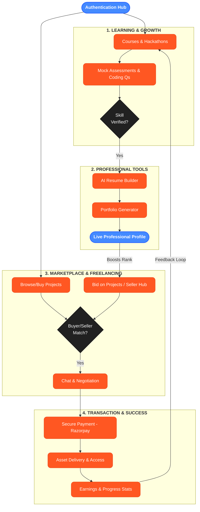
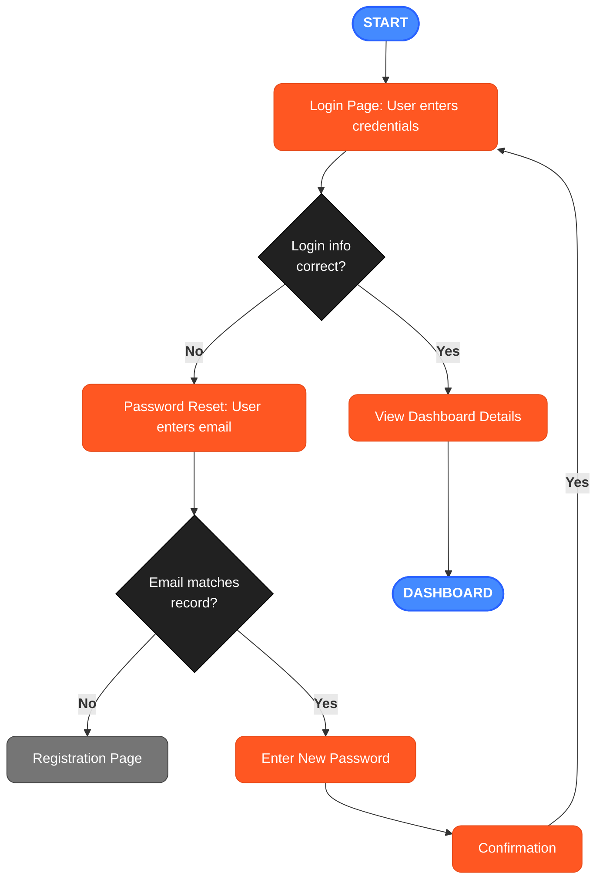
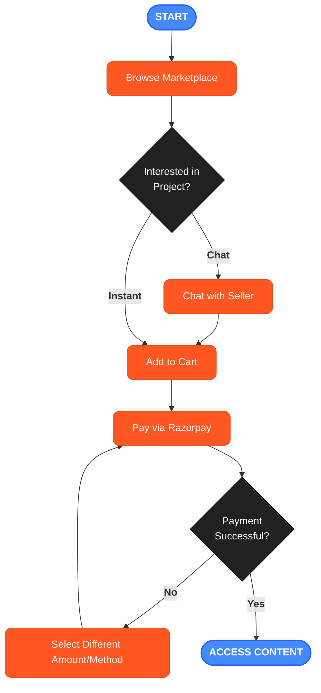
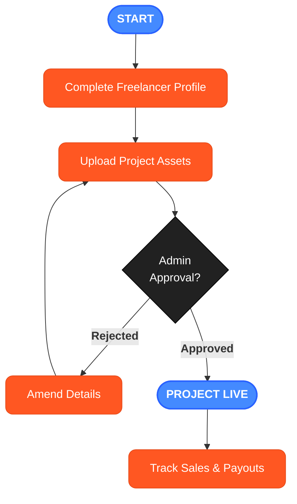

# Project Bazaar Total Ecosystem

This section captures the "Bigger Perspective" — how the different modules of Project Bazaar (Marketplace, Learning, Growth, and Freelancing) intersect to create an end-to-end professional lifecycle.

## The Holistic Platform Journey

---

# Detailed User Flows

## High-Level Visual Flow

## 1. Authentication & Onboarding Flow

## 2. Buyer Purchase Journey

## 3. Freelancer / Seller Journey

