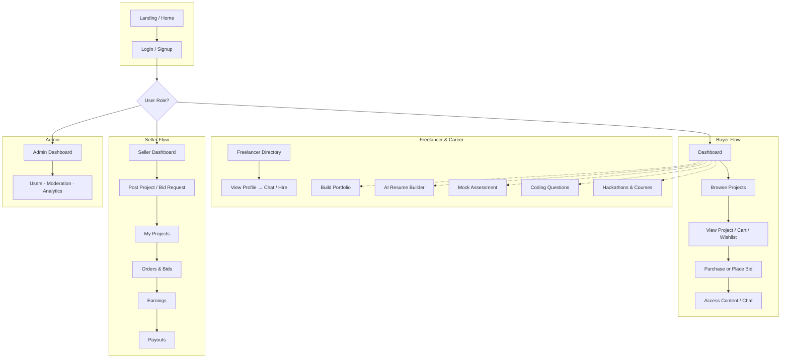

# Project Bazaar – User Flow

View this file in VS Code (with a Mermaid extension), on GitHub, or paste the code block into [Mermaid Live Editor](https://mermaid.live) to export as PNG/SVG.

## Summary

| Role   | Main path |
|--------|-----------|
| **Buyer** | Home → Auth → Dashboard → Browse projects / Freelancers / Career tools → Purchase, bid, or hire |
| **Seller** | Home → Auth → Seller Dashboard → Post project or bid request → Manage projects → Earnings → Payouts |
| **Admin**  | Home → Auth → Admin Dashboard → Users, moderation, analytics |

To export as image: copy the contents of the `flowchart TB` block (from `flowchart TB` to the last `end`) into [mermaid.live](https://mermaid.live), then use **Actions → Export** (PNG or SVG).
